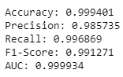
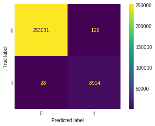

# Intrusion-Detection-System

This Intrusion Detection System uses Logistic Regression to differentiate between Valid url request queries and Malicious url request queries for Web Applications.

The dataset for Valid Queries can be found at: http://www.secrepo.com/
The dataset for Malicious Queries can be found at: https://github.com/foospidy/payloads

The pruned datasets can be found in the repo:

[Valid Queries](validqueries.txt) &nbsp; &nbsp; [Malicious Queries](badqueries.txt)

## Accuracy

Using just Logistic Regression, I was able to achieve an accuracy of 99.94% with in only 28 out of 8881 malicious queries passed through the Intrusion Detection System.

